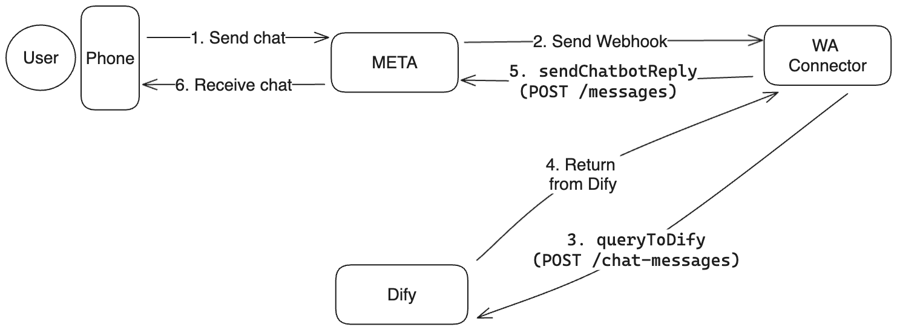
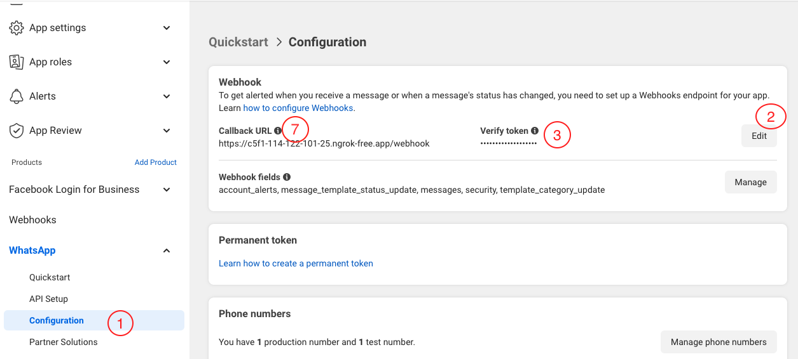
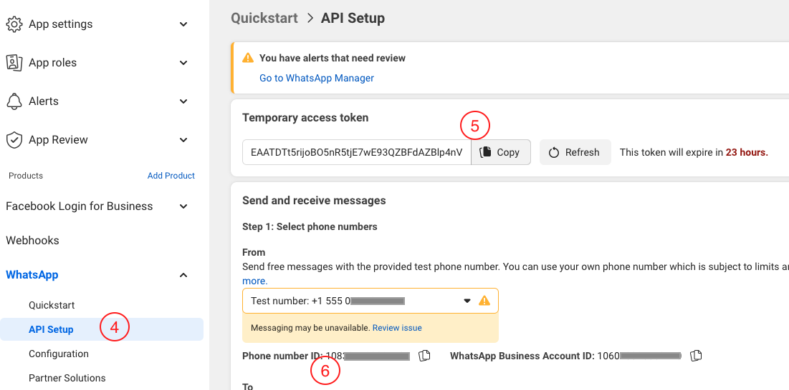
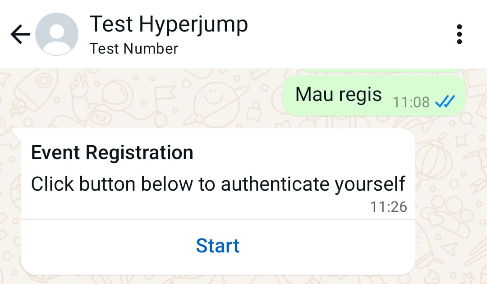
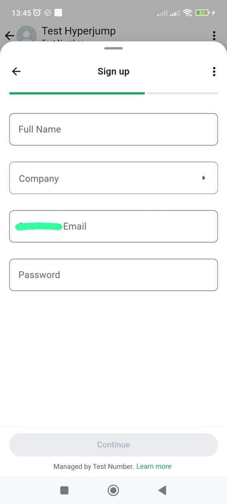
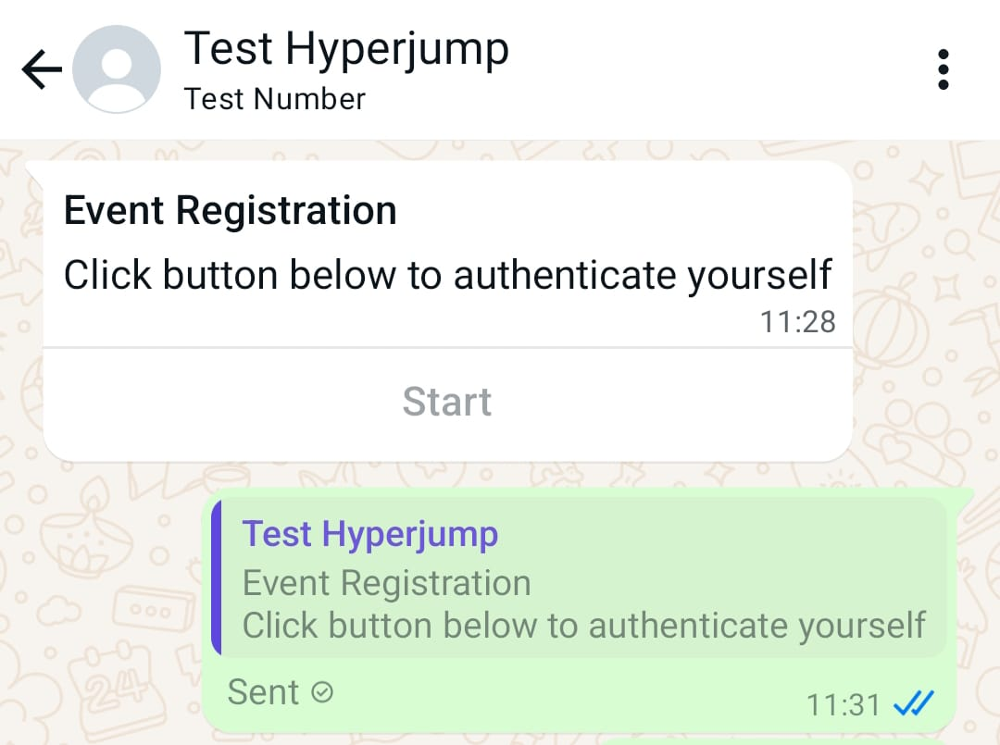

[](https://github.com/hyperjumptech/whatsapp-chatbot-connector/actions/workflows/code-quality.yml)

# WhatsApp Chatbot Connector

This project is a WhatsApp Chatbot Connector backend built using Express.js. It is designed to integrate with the WhatsApp Business API and supports various AI platforms such as Dify and Rasa.

Here is the diagram to understand the flow:


## Features

- Webhook endpoint to receive messages from WhatsApp
- Integration with Dify and Rasa for natural language processing and response generation
- Displaying interactive whatsapp message like [List](https://developers.facebook.com/docs/whatsapp/cloud-api/messages/interactive-list-messages), [Reply Buttons](https://developers.facebook.com/docs/whatsapp/cloud-api/messages/interactive-reply-buttons-messages), and [Flow](https://developers.facebook.com/docs/whatsapp/cloud-api/messages/interactive-flow-messages)

## Prerequisites

Ensure you have the following installed:

Node.js (v18.x or later)
npm (v10.x or later)

## Getting Started

1. Clone the Repository

```bash
git clone https://github.com/yourusername/whatsapp-chatbot-connector.git
cd whatsapp-chatbot-connector
```

2. Install Dependencies

```bash
npm install
```

3. Set Environment Variables

```bash
cp .env.example .env
```

then fill in the appropriate values in the .env file.

Choose to connect to which platform by filling the `CONNECTION_PLATFORM` variable in the .env file.

```
CONNECTION_PLATFORM=dify
```

or

```
CONNECTION_PLATFORM=rasa
```

4. Running the Server

```bash
npm run dev
```

5. Set callback URL in WhatsApp Business API

In the WhatsApp Business API, go to the **Configuration** menu and fine the **Callback URL**. Detail on the [picture below](#whatsapp-business-api-configuration), poin **number 7**

If you are running on local, you can use [ngrok](https://ngrok.com/docs/getting-started/) to get a public URL for your local server.

6. Send text message to the WhatsApp Business API

Now just use your WhatsApp app to send a text message to the WhatsApp Business number and you will see the response from the chatbot connected.

## Environment Variables

| Variable Name            | Description                                                                                                                                          | Example                                     |
| ------------------------ | ---------------------------------------------------------------------------------------------------------------------------------------------------- | ------------------------------------------- |
| NODE_ENV                 | Environment variable to set the node environment.                                                                                                    | development                                 |
| WEBHOOK_VERIFY_TOKEN     | Webhook verification token. The value should be the same as the one you set in the WhatsApp Business API. Detail in picture below, poin **number 2** |
| GRAPH_API_TOKEN          | Graph API token. The value should be the same as the one you set in the WhatsApp Business API. Detail in picture below, poin **number 5**            | abacdefghijk                                |
| BUSINESS_PHONE_NUMBER_ID | Business phone number ID. The value should be obtained from WhatsApp Business API. Detail in picture below, poin **number 6**                        | 12345678912323                              |
| DIFY_BASE_URL            | Dify base URL.                                                                                                                                       | https://api.dify.ai/v1                      |
| DIFY_API_KEY             | Dify API key.                                                                                                                                        | app-Jdasdsdsd98n98787y                      |
| RASA_BASE_URL            | Rasa base URL.                                                                                                                                       | http://localhost:5005/webhooks/rest/webhook |
| CONNECTION_PLATFORM      | Platform to connect to. value should be `dify` or `rasa`                                                                                             | dify                                        |
| SESSION_DATABASE         | Database to store session. value should be `in-memory` or `redis`                                                                                    | in-memory                                   |
| REDIS_URL                | Redis URL. Required if `SESSION_DATABASE` is set to `redis`                                                                                          | redis://localhost:6379                      |

## WhatsApp Business API Configuration




## Interactive Message Configuration

### Flow

To create a Flow, you must setup many things like in the [docs](https://developers.facebook.com/docs/whatsapp/flows). I will mention over-simplified version for easy starting point:

1. Create a Flow
2. Setup server endpoint
3. Setup Dify to trigger sending HTTP Request with this [JSON format](https://developers.facebook.com/docs/whatsapp/flows/gettingstarted/sendingaflow). Here is the example request body:

```json
{
  "recipient_type": "individual",
  "messaging_product": "whatsapp",
  "to": "{{#sys.user_id#}}",
  "type": "interactive",
  "interactive": {
    "type": "flow",
    "header": {
      "type": "text",
      "text": "Event Registration"
    },
    "body": {
      "text": "Click button below to authenticate yourself"
    },
    "action": {
      "name": "flow",
      "parameters": {
        "mode": "draft", // delete this field for production use (when your flow is published)
        "flow_message_version": "3",
        "flow_token": "auth_flow-{{#sys.user_id#}}.",
        "flow_id": "1234567812345678",
        "flow_cta": "Start",
        "flow_action": "data_exchange"
      }
    }
  }
}
```

4. It will send CTA button to trigger the Flow
   
5. Fill in, complete, and submit the form
   
6. Sent status will be displayed
   

## Deployment

You can deploy this app to any server that runs Node.js. The easiest one is to use Vercel. Just clone this repo and connect it from Vercel Dashboard then you are good to go.

## License

This project is licensed under the MIT License. See the LICENSE file for details.
